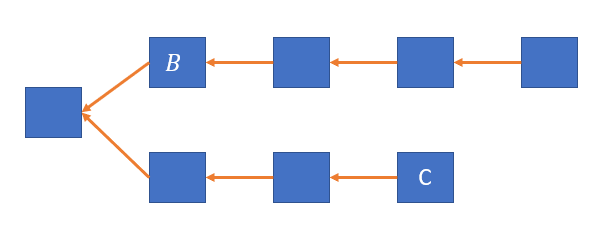
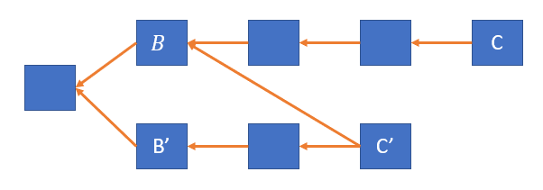

```
  KIP: 5
  Layer: API/RPC
  Title: Counting Transaction Confirmations Better
  Author: Shai Wyborski <shai.wyborski@mail.huji.ac.il>
  Status: proposed
```

# Motivation
The current interface for counting confirmations of a transaction tx contained in a block B simply counts how many confirmations are above the block (or more precisely, the maximum thereof over all blocks containing txn). There are three problems with this measure:
1. It disregards competing chain. For example, in the illustrated scenario the block B would have three confirmation even though tx could be excluded by posting a single block containing a transaction conflicting tx pointing only at C.

2. It does not take into account visible conflicts. For example, consider the following scenario and say that B' contains a transaction conflicting tx. The block B is a selected chain block so it precedes B'. B has four confirmations whereas B' only has two. However, a single block pointing only at C' can reorg the chain so that B' is in the selected chain and B is invalid.


It should be noted that these issues are not severe as they might seem. Counting confirmations is similar to the confirmations in Bitcoin, where only the heaviest chain is considered, and a transaction is deemed safe after e.g. four confirmations even if the network is aware of a competing chain only one block short of reverting the transaction (which follows since in blockchains, nodes do not retransmit orphan blocks).

However, the inclusive nature of Kaspa allows us to produce better confidence metrics against double-spend attacks. I propose a metric called *confidence* that roughly measures how many seconds of a 51% attack are required to revert the transaction, considering *all* visible blocks. I argue that this measure should become the standard metric for how confirmed a block is, and the ecosphere (in particular block explorers and wallet GUIs) should be adjusted accordingly.

# Defining and computing confidence
Intuitively, the *confidence* of a txn is defined as bc/BPS where bc is the number of blocks required to revert txn assuming that:
1. the adversary always wins ties
2. the difficulty is constant

Assumption 1 is reasonable since it assumes a powerful adversary and thus errs on the side of caution. Assumption 2 is reasonable given that the relative change in global hashrate during the confirmation period is negligible. Typically, confirmation periods are in the orders of seconds to minutes, during which difficulty does not change by more than a fraction of a percent.

**Remark**: Assumption 2 implies that the confidence measure becomes inaccurate when considered for long periods of time, or during times of extreme difficulty changes. However, these limitations hold the same for any measure that only considers the number of blocks and disregard their weight, including counting confirmations. I discuss this more in the next section.

To compute bc, note that the best starting point of an adversary would be to include in its past all blocks that do not include txn in their UTXO set. So bc would be the difference between the blue score of the selected parent and the maximal possible blue score of a block only pointing at blocks that do not have txn in their UTXO set.

This could be computed as follows:

    Let X be the set of all blocks in the past of mergeable tips that contain txn
    Let X' be the set of all blocks in the past of mergeable tips that contain a transaction conflicting txn
    \\note that once a single block B containing txn is known, X and X' can be computed by traversing B.anti_cone
    Let Y be the set of minimal blocks (in terms of reachability) whose past intersects both X and X'
    Let Y' be the subset of Y containing all blocks whose GHOSTDAG ordering precedents X' (equiv. whose UTXO set does not include txn)
    Let AC={}
    Start a BFS from all the mergeable tips, where upon reaching block B:
      if B.past doesn't intersect X, AC.add(B), terminate
      if B.past intersects X but not X', terminate
      if B.past intersects both X and X', then necessarily B.selected_chain intersects Y at a block C. If C in Y', add B to AC. In both cases terminate.
      if B in C.past for some C in AC, terminate
      if B.past intersects AC, let AC = AC ∪ {B} / B.past, terminate
      otherwise, recurse BFS to the parents of B
    For B in X:
        For C in B.parents:
            if C is not in the past of any block from AC:
                add C to AC
    Return selected_tip.blue_score - ac_score where ac_score is the blue score of a virtual block whose parents are AC otherwise
 
Note that the complexity of this algorithm does not increase with time (up to increae in the complexity of reachability queries) after X drops below the mergeability threshold.

# Interpreting confidence
The confidence is normalized by BPS, so that it could always be interpreted in units of seconds, regardless of the block production rate.

Assumption 2 implies that the confidence measure becomes inaccurate when considered for long periods of time, or during times of extreme difficulty changes. However, these limitations hold the same for any measure that only considers the number of blocks and disregard their weight, including counting confirmations. Interpreting the consequences of changing difficulty is impossible without making assumptions on how the *fraction* of the attacker's hashrate changes over time. It can be shown that if the attacker's fraction never goes significantly above 50%, then the length of the attack is bound from below by the confidence.

A more interesting interpretation is in terms of 49% attacks. The probability that a 49% attacker suceeds in reverting txn decreases exponentially as the confidence increases. This is not generally true for plainly counting confirmations.

The approximation provided by the confidence, even when the global hashrate is fixed, improves linearly with the BPS. The confidence is only meaningful for periods of time where sufficiently blocks are created to reduce the variance of the Poisson process of block craetion. Increasing the BPS decreases the variance by direct proportion.

# Backwards compatibility
Does not affect consensus or other API calls.
